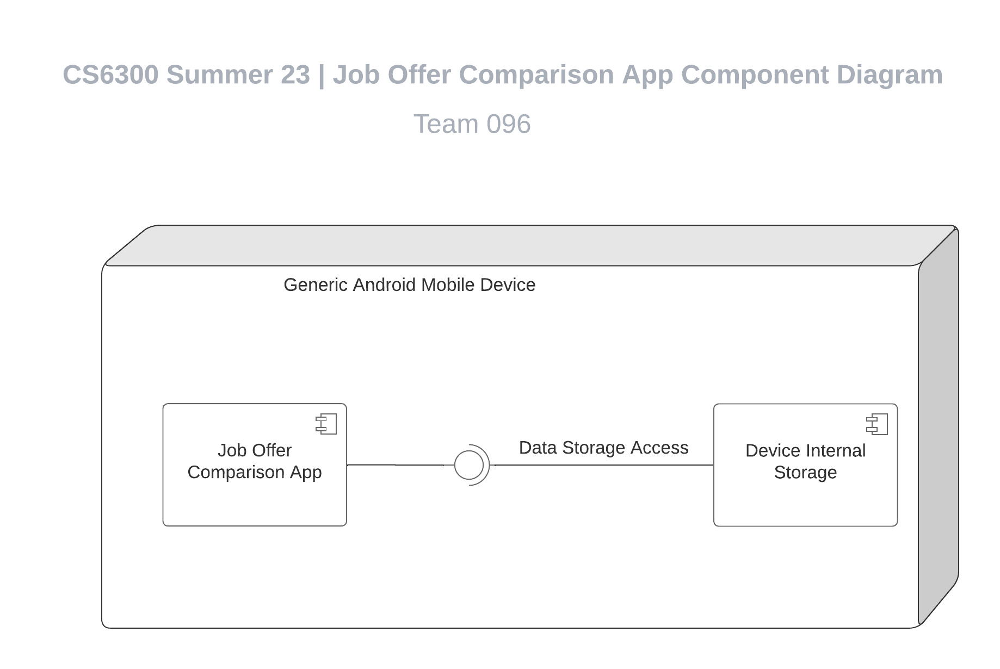
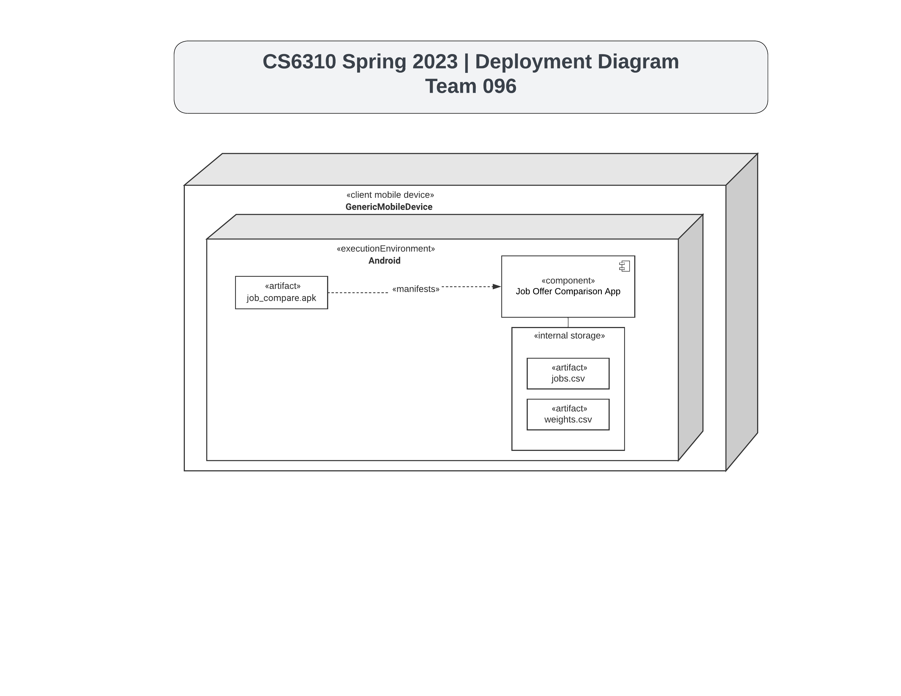
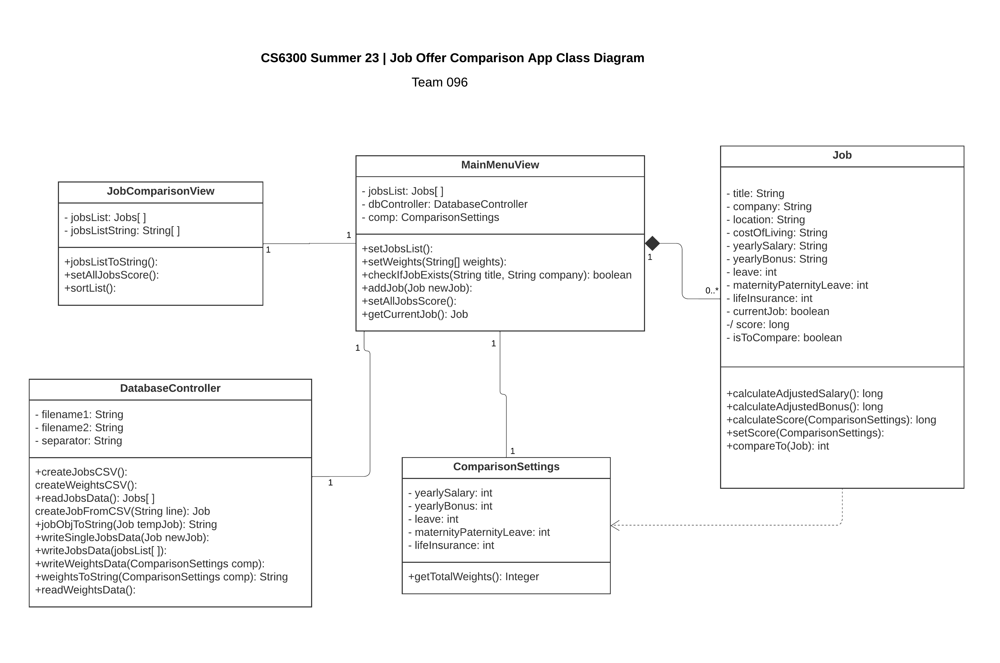
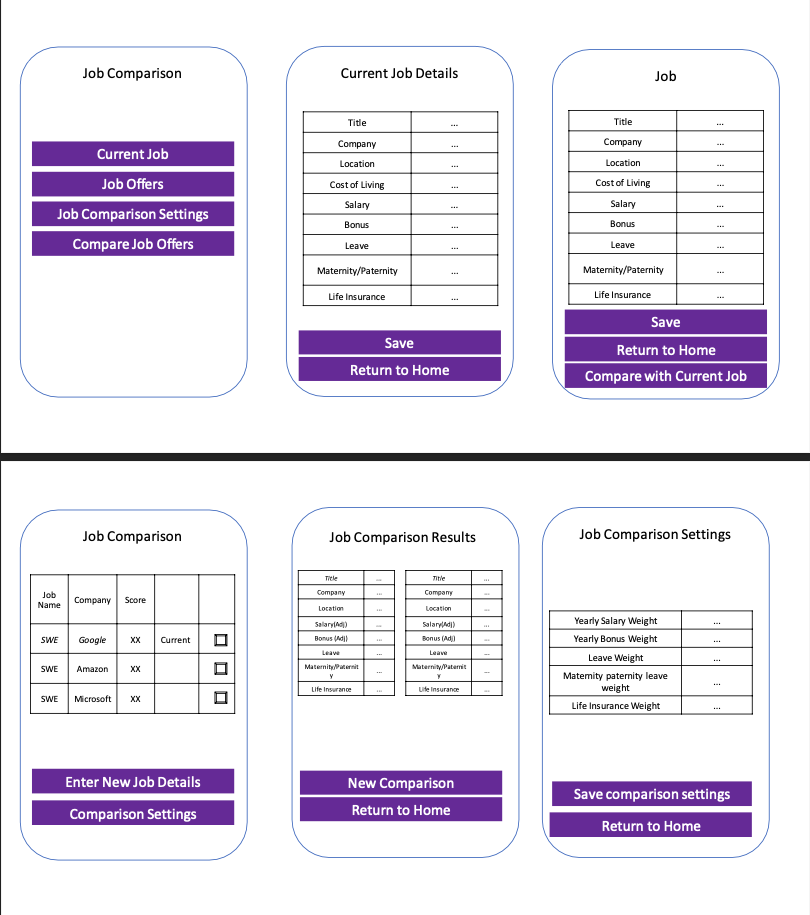

v2: Updated deployment diagram
v3: Updated diagrams, fixed broken embedded images link

# Design Document

**Author**: Team096 (Jonathan David Nocek, Jason Kahei Tam, Scott Jacob Van Tilburg)

## 1 Design Considerations

### 1.1 Assumptions

1. The app will be designed with running on a single system in mind, there will be no communication or saving between devices. 
2. The app will only run on Android mobile devices 
3. The app is a single user system, which means all job offers are related to only one user. 
4. When the user reopens the app after entering job details, the data entered in the previous session still exists.

### 1.2 Constraints

1. To implement data persistence, the app will need to communicate with some form of database.

### 1.3 System Environment

The system is able to be deployed on a mobile device (phone or tablet) that is running the chosen minimum Android version or better. The minimum Android version and other configuration settings will be declared by the manifest XML file. In order to let the user save job offers, the app will read and write data to the internal storage of the user's device.

## 2 Architectural Design

### 2.1 Component Diagram

### 2.2 Deployment Diagram

## 3 Low-Level Design

### 3.1 Class Diagram

### 3.2 Other Diagrams

None

## 4 User Interface Design

## 5 Supplementary Requirements

*This section should describe the supplementary requirements for the system.*

1. The interface must be intuitive. It must be easy for the user to navigate and use.
2. The interface must be responsive. It must load and navigate in a user-freindly way
3. The interface must be reliable. It must accurately display the information.
4. The interface must be scalable. It must be able to support simulanteous users and many jobs/job offers.
5. The interface must be fault-tolerant. It must be able to handle user errors and unexpected actions.
6. The interface must be documented. 
7. The interface must be testable.

