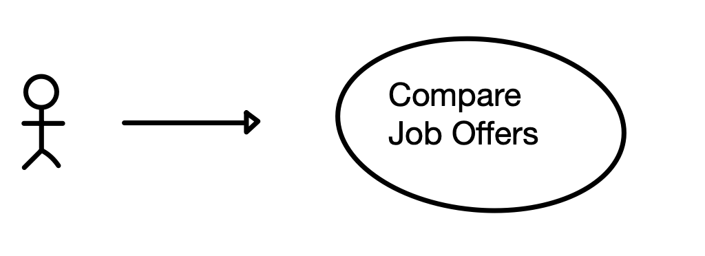

# Use Case Model

**Author**: Team096

## 1 Use Case Diagram

## 2 Use Case Descriptions

- **Requirements:** The system will allow the user to select two job offers, enter the details if needed, and perform a comparison.
- **Pre-conditions:** 
    - The user must access the system througha Java handheld device.
    - User has jobs to enter into system. 
- **Post-conditions**
    - system may be reused
    - entered jobs and thir informaiton is persisted.
- **Scenarios:**
**1. Job Comprison Scenario**
    1. User accesses sytem on a mobile device and starts comparison use case scenario.
    2. The user chooses to add or edit a job with the below details:
        - title
        - Company
        - Location (entered as city and state)
        - Cost of living in the location (expressed as an index)
        - Yearly salary
        - Yearly bonus
        - Leave (number of whole days from 0 to 30 inclusive)
        - Maternity/Paternity Leave (number of whole days from 0 to 20 inclusive)
        - Life Insurance (Percentage of Salary as an integer: 0 - 10)
    3. The user adds a second job if no if none other jobs are present. 
        - if other jobs are present, skip to 4. 
    4. The user selects two available jobs for comparison.
    5. The user adjusts comparison settings. 
    6. User views comparison and exits if satisfied.

